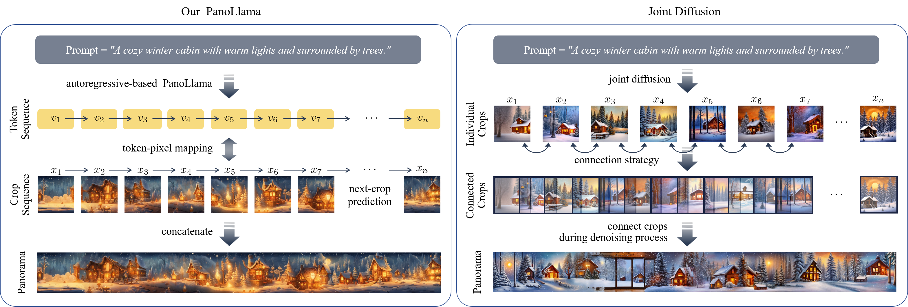

# 🦙PanoLlama: Generating Endless and Coherent Panoramas with Next-Token-Prediction LLMs



## Introduction

What is **PanoLlama**:

> 1. **New Paradigm**: A novel framework that redefines panoramic image generation as a next-token prediction task, fundamentally demonstrating its superiority over diffusion-based methods.
> 2. **Speed Up**: We developed a training-free autoregressive strategy on the pre-trained [LlamaGen](https://arxiv.org/abs/2406.06525) architecture, achieving panorama generation of high quality and arbitrary size.
> 3. **Versatile Applications**: Beyond text-to-panorama generation, it also supports multi-scale, multi-layout, and multi-guidance generation tasks.
> 4. **Comprehensive Evaluation**: We evaluate our method across a range of baselines and metrics, ensuring the reliability of our experimental results.

For more details, please visit our [paper page](https://arxiv.org/abs/2411.15867).

## Get Started

**Configuration** &ensp; Set up and configure the environment by installing the required packages:

```bash
pip install -r requirements.txt
```

**Pre-trained Models** &ensp; Download pre-trained models from [LlamaGen](https://github.com/FoundationVision/LlamaGen), and place them in the folder `/models` under the corresponding modules:

|     module     |    model    | params | tokens |                                               weight                                               |
| :-------------: | :---------: | :----: | :----: | :-------------------------------------------------------------------------------------------------: |
|  text encoder  | FLAN-T5-XL |   3B   |   /   |                    [flan-t5-xl](https://huggingface.co/google/flan-t5-xl/tree/main)                    |
| image tokenizer |    VQVAE    |  72M  | 16x16 |       [vq_ds16_t2i.pt](https://huggingface.co/peizesun/llamagen_t2i/resolve/main/vq_ds16_t2i.pt)       |
| token generator | LlamaGen-XL |  775M  | 32x32 | [t2i_XL_stage2_512.pt](https://huggingface.co/peizesun/llamagen_t2i/resolve/main/t2i_XL_stage2_512.pt) |

**Generation** &ensp; We support panorama expansion in vertical, horizontal, and both directions. Try the following command to generate a horizontal one:

```bash
python -m token_generator.sample \
    --seed -1 \
    --times 12 \
    --addit-cols 24 \
    --lam 1 \
    --gen-mode h \
    --n 1
```

## Citation

If you find our work helpful, please consider citing:

```bibtex
@article{zhou2024panollama,
  title={PanoLlama: Generating Endless and Coherent Panoramas with Next-Token-Prediction LLMs},
  author={Zhou, Teng and Zhang, Xiaoyu and Tang, Yongchuan},
  journal={arXiv preprint arXiv:2411.15867},
  year={2024}
}
```
